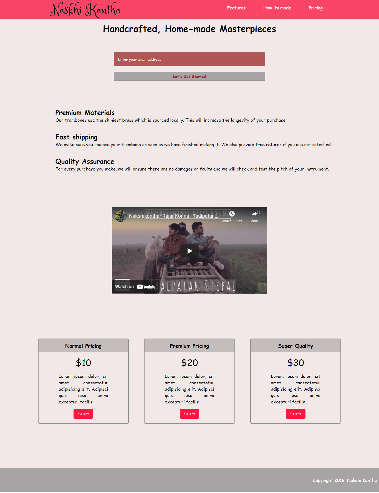

# Product Landing Page

This is a solution to the Free Code Camp Product Landing Page challenge.

## Table of contents

- [Overview](#overview)
  - [Screenshot](#screenshot)
  - [Links](#links)
- [My process](#my-process)
  - [Built with](#built-with)
- [Author](#author)

## Overview

Simple one page free code camp project. This is a landing page for Nakshi Kantha.
### Screenshot

### Links

- Solution URL: [Code Link](https://github.com/shamratPG/product-landing-page)
- Live Site URL: [Live Site](https://shamratpg.github.io/product-landing-page/)

### Built with

- Semantic HTML5 markup
- CSS custom properties

## Author

- Website - [Md. Shamrat Hossain](https://github.com/shamratPG)
- Twitter - [@shamratpg](https://twitter.com/shamratpg)
